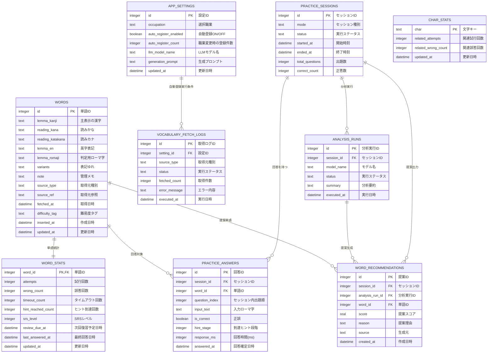

# ER図（word_practice / MVP）

## 補足
- `CHAR_STATS` は全回答テキストからの集計テーブルで、単語テーブルへの直接FKは持たない。
- `WORD_STATS` は `WORDS` と1対1で集計を保持する。
- `APP_SETTINGS` は単一ユーザー運用のため原則1レコード運用とし、実装時に `id = 1` を固定する。
- `CHAR_STATS.char` は MVP ではローマ字1文字単位で集計する。

## 列挙値定義
| 項目 | 許容値 | 意味 |
|---|---|---|
| `WORDS.source_type` | `user`, `seed`, `internet`, `llm` | ユーザー登録語、初期語彙、インターネット取得語、ローカルLLM生成語 |
| `PRACTICE_SESSIONS.status` | `running`, `completed`, `aborted`, `failed` | 実行中、正常完了、途中中断、保存失敗 |
| `VOCABULARY_FETCH_LOGS.source_type` | `internet`, `llm` | インターネット取得処理、ローカルLLM生成処理 |
| `VOCABULARY_FETCH_LOGS.status` | `running`, `completed`, `failed` | 実行中、正常完了、取得失敗 |
| `ANALYSIS_RUNS.status` | `running`, `completed`, `failed` | 分析中、正常完了、分析失敗 |
| `WORD_RECOMMENDATIONS.source` | `rule`, `llm`, `hybrid` | 統計ベース、LLMベース、統合スコア |

## 各テーブルの説明
| テーブル名 | 役割 | 主な参照先 |
|---|---|---|
| `WORDS` | 出題・判定に使う単語マスタ。漢字表示・かな/カナ/英字表記・ローマ字判定・取得元情報を保持。 | `PRACTICE_ANSWERS`, `WORD_STATS`, `WORD_RECOMMENDATIONS` |
| `APP_SETTINGS` | 職業選択、自動登録ON/OFF、LLM生成条件などのアプリ設定を保持。 | `VOCABULARY_FETCH_LOGS` |
| `PRACTICE_SESSIONS` | 1回の練習セッション単位の記録（開始終了、状態、出題数、正答数）。 | `PRACTICE_ANSWERS`, `ANALYSIS_RUNS`, `WORD_RECOMMENDATIONS` |
| `PRACTICE_ANSWERS` | 各設問の回答ログ（出題順、入力文字列、正誤、ヒント到達、回答時間、回答確定時刻）。 | `WORDS`, `PRACTICE_SESSIONS` |
| `WORD_STATS` | 単語ごとの集計結果とSRS状態（試行回数、誤答回数、復習レベル、次回復習予定など）。 | `WORDS` |
| `CHAR_STATS` | 文字単位の傾向集計（関連試行・関連誤答）。 | 直接FKなし（回答ログ集計） |
| `VOCABULARY_FETCH_LOGS` | 外部/ローカル語彙取得処理の実行履歴と結果。職業設定に基づく自動登録実行も記録。 | `APP_SETTINGS` |
| `ANALYSIS_RUNS` | セッション終了時のLLM分析実行履歴（モデル、状態、要約）。 | `PRACTICE_SESSIONS` |
| `WORD_RECOMMENDATIONS` | 次回練習向けの推奨単語と提案理由・スコア。どの分析実行から出た提案かも保持する。 | `PRACTICE_SESSIONS`, `ANALYSIS_RUNS`, `WORDS` |

## この設計にした理由
- タイピング主軸に合わせるため:
  - `WORDS` に `lemma_kanji`（表示）と `lemma_romaji`（判定）を分け、さらに `reading_kana` / `reading_katakana` / `lemma_en` を独立保持し、要件の「表示は漢字・入力はローマ字」「かな/カナ/漢字/英字を保持」をそのままデータで表現できるようにした。
- セッション再現性を確保するため:
  - `PRACTICE_SESSIONS` と `PRACTICE_ANSWERS` を分離し、さらに `question_index` と `answered_at` を持たせることで、1回の練習で「いつ・何問目に・何をどう回答したか」を追跡できるようにした。
- 苦手分析を高速化するため:
  - 生ログ（`PRACTICE_ANSWERS`）とは別に集計テーブル（`WORD_STATS`, `CHAR_STATS`）を持たせ、SRS状態も `WORD_STATS` に保持して、毎回の重い集計を避けつつ復習優先度計算を即時に行えるようにした。
- LLM提案の検証可能性を担保するため:
  - `ANALYSIS_RUNS` と `WORD_RECOMMENDATIONS` を分け、さらに `analysis_run_id` で提案の生成元を固定し、分析実行履歴と提案結果を後から一対多で検証できるようにした。
- 外部語彙取り込みの運用性を上げるため:
  - `WORDS` に `source_type/source_ref/fetched_at`、別途 `VOCABULARY_FETCH_LOGS` を持たせ、取得元・失敗原因・再実行履歴を管理できるようにした。
- 職業ベース自動登録を再現可能にするため:
  - `APP_SETTINGS` に職業とLLM生成条件を保存し、`VOCABULARY_FETCH_LOGS` に `setting_id` を持たせて「どの設定で自動登録が実行されたか」を追跡できるようにした。
- 障害時の状態判定を可能にするため:
  - `PRACTICE_SESSIONS` に `status` を持たせ、正常完了・途中中断・保存失敗を区別できるようにした。
- SQLite3前提で実装を単純化するため:
  - 単一ユーザー運用を前提に、必要十分な正規化に留めつつテーブル数を抑え、実装初期の複雑性と運用負荷を下げた。
