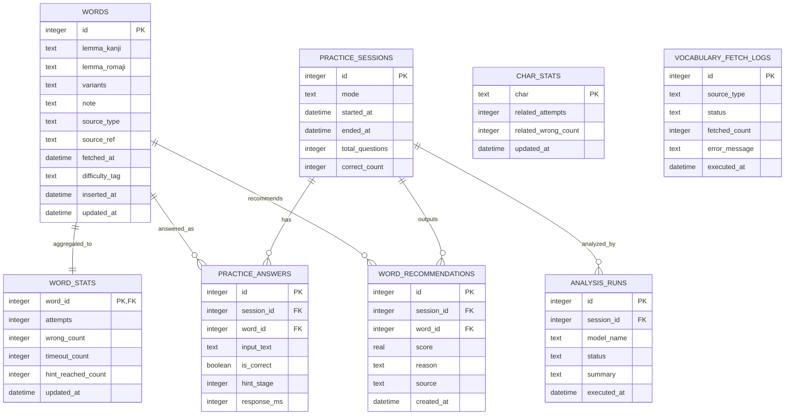

# ER図（word_practice / MVP）

## 補足
- `CHAR_STATS` は全回答テキストからの集計テーブルで、単語テーブルへの直接FKは持たない。
- `WORD_STATS` は `WORDS` と1対1で集計を保持する。

## この設計にした理由
- タイピング主軸に合わせるため:
  - `WORDS` に `lemma_kanji`（表示）と `lemma_romaji`（判定）を分け、要件の「表示は漢字・入力はローマ字」をそのままデータで表現できるようにした。
- セッション再現性を確保するため:
  - `PRACTICE_SESSIONS` と `PRACTICE_ANSWERS` を分離し、1回の練習で「いつ・何問・何をどう回答したか」を追跡できるようにした。
- 苦手分析を高速化するため:
  - 生ログ（`PRACTICE_ANSWERS`）とは別に集計テーブル（`WORD_STATS`, `CHAR_STATS`）を持たせ、毎回の重い集計を避けてUI表示を軽くした。
- LLM提案の検証可能性を担保するため:
  - `ANALYSIS_RUNS` と `WORD_RECOMMENDATIONS` を分け、分析実行履歴と提案結果を独立して保存し、後から妥当性を検証できるようにした。
- 外部語彙取り込みの運用性を上げるため:
  - `WORDS` に `source_type/source_ref/fetched_at`、別途 `VOCABULARY_FETCH_LOGS` を持たせ、取得元・失敗原因・再実行履歴を管理できるようにした。
- SQLite3前提で実装を単純化するため:
  - 単一ユーザー運用を前提に、必要十分な正規化に留めつつテーブル数を抑え、実装初期の複雑性と運用負荷を下げた。
